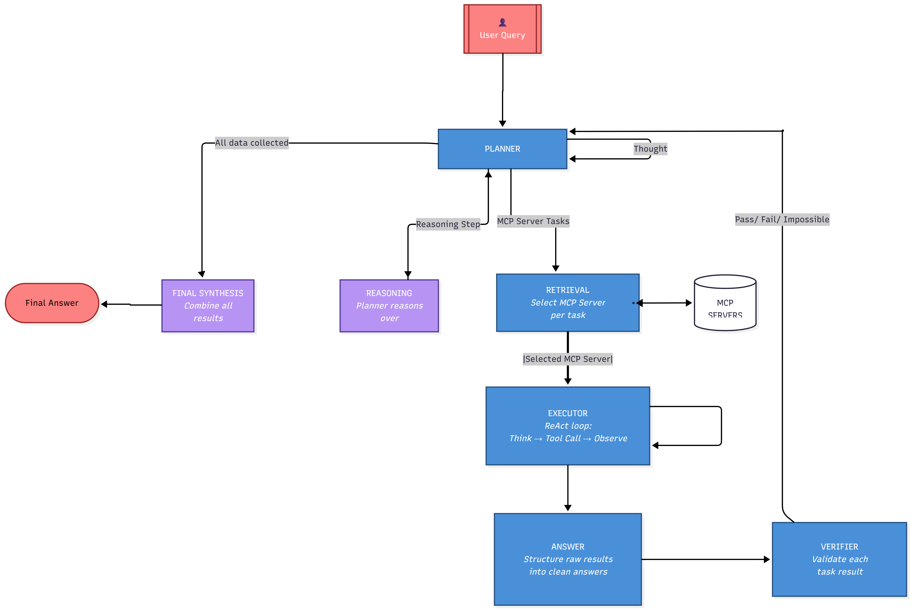

# Multi-Agent MCP System

> Designed, implemented, and benchmarked by **Konstantinos Kotsaras**.

A multi-agent system built on top of the Model Context Protocol (MCP) that
answers complex user queries by coordinating a pool of specialized LLM
agents and external tool servers. The system decomposes a query into a
directed acyclic graph (DAG) of tasks, routes each task to the right MCP
server, executes it, verifies the answer, and synthesizes a final
response. When a step fails it replans automatically using the
accumulated failure history so the same mistake is not repeated.

The repository also ships a full benchmark harness against MCP-Bench so
the multi-agent system can be compared head-to-head against the official
single-agent runner on identical tasks and identical judging.

---

## Architecture

The system is **not** a fixed pipeline. The Planner sits at the centre
of a loop and chooses, on every cycle, which downstream agents (if any)
need to run before returning control to itself. Three possible paths
through one cycle:

- **Tool-using step** — Retrieval → Executor (ReAct loop) → Answer → Verifier, then back to the Planner.
- **Reasoning-only step** — the Planner handles it directly and skips the rest of the agents.
- **Final synthesis** — once all steps are done, the Planner produces the final answer.



### Planner Agent
The Planner is the only agent that decides when the loop terminates. It
plays three distinct roles, chosen on each cycle from the current state:

| Situation | What the Planner does |
|---|---|
| No plan exists | Generate the initial DAG of tasks |
| Last step passed | Advance `current_step_index` |
| Last step failed | Replan, using `failure_history` as context |
| Current step is **reasoning-only** | Reason over collected data directly — bypass Retrieval / Executor / Answer / Verifier entirely |
| All steps done | Run **final synthesis** and write `final_output` |
| Query proven unanswerable | Run **unanswerable synthesis** (faithful "we could not find X" answer) |

Plans are DAGs where tasks within a step can run in parallel and later
steps depend on the verified results of earlier ones. Reasoning steps
and final answers are produced *by the Planner itself*, not by a
downstream agent.

### Retrieval Agent
Maps each task in the current step to the most appropriate MCP server by
LLM reasoning over the live server inventory. Servers that previously
failed for a given task are excluded from selection
(`excluded_servers[task_id]`).

### Executor Agent(ReAct loop)
Runs each task with a ReAct (Reason + Act) loop. The LLM cycles through
**Thought → Action (tool call) → Observation** until it decides to stop
with a final result:

```
   ┌──────────────────────────────────────────────┐
   │                                              │
   ▼                                              │
┌─────────┐       ┌─────────┐       ┌───────────┐ │
│ Thought ├──────►│ Action  ├──────►│Observation├─┘
│ (why?)  │       │(tool +  │       │           │
│         │       │  args)  │       │           │
└─────────┘       └────┬────┘       └───────────┘
                       │
                       └──► STOP (final answer)
```

Duplicate `(tool, args)` pairs are blocked to prevent infinite tool loops.
Per-call observations are truncated to 4000 chars (matching the official
agent) so the prompt stays inside the context window.

### Answer Agent
Receives the raw tool outputs from the Executor and structures them into
a *verification package*: one natural-language answer per task plus an
`all_parts_found` flag indicating whether the required data was actually
returned.

### Verifier Agent
Compares each task's answer against its original description and decides:

- `pass` — all tasks answered correctly; the Planner advances to the next
  step.
- `fail` — one or more tasks failed; the Planner is invoked for a replan.
- `impossible` — the query cannot be answered (e.g. a living person's
  death date); replanning stops and the Planner runs unanswerable
  synthesis from whatever was collected.

---

## Configuration

All runtime settings live in [`multi_agent_system/config.py`](multi_agent_system/config.py).
Prefer environment variables over editing the file directly.

| Env var | Default | Purpose |
|---|---|---|
| `MULTIAGENT_BASE_URL` | `https://openrouter.ai/api/v1` | OpenAI-compatible endpoint |
| `MULTIAGENT_MODEL` | placeholder (must be set) | Model id used by every agent |
| `OPENROUTER_API_KEY` | `api_key` placeholder | OpenRouter key (preferred) |
| `MULTIAGENT_API_KEY` | falls back from above | Generic key for other backends |

### Backend-specific behavior

`make_model_kwargs()` in `config.py` tailors `extra_body` per backend:

- **OpenRouter** → injects provider routing (`Together, DeepInfra, Venice,
  AkashML, fallbacks=True`), byte-for-byte identical to the official
  MCP-Bench runner so results stay comparable.
- **Local vLLM** → sets `chat_template_kwargs.enable_thinking=False` to
  disable qwen3.x "thinking mode" output that would otherwise exhaust the
  completion budget before any JSON is produced.

If you switch the model to a reasoning family (qwen3.x, deepseek-r1,
OpenAI o-series), remove the `response_format={"type":"json_object"}`
kwarg at each agent's `ChatOpenAI(...)` call site — the strict-JSON
constraint triggers runaway chain-of-thought on these models. The Strict
JSON instructions baked into `prompts/agent_prompts.py` are enough to
enforce the format on their own.

### Per-agent model overrides

By default all five agents share `DEFAULT_MODEL`. Override any of
`MODEL_FOR_PLANNING`, `MODEL_FOR_RETRIEVAL`, `MODEL_FOR_EXECUTOR`,
`MODEL_FOR_ANSWERING`, `MODEL_FOR_VERIFIER` in `config.py` if you want a
heterogeneous pipeline (e.g. a cheaper model for retrieval, a stronger
one for planning).

---

## Setup

1. **Generate the server inventory** — run once to discover all MCP
   servers and write `multi_agent_system/inventory_summary.json`:

   ```bash
   python utils/collect_mcp_info.py
   ```

2. **Provide MCP server API keys** — some MCP servers need external
   credentials to work. They are loaded automatically from
   `./mcp_servers/api_key`. The repository ships a template; copy it
   and fill in your own values:

   ```bash
   cp mcp_servers/api_key.example mcp_servers/api_key
   # then edit mcp_servers/api_key and replace YOUR_KEY_HERE with real keys
   ```

   The real `mcp_servers/api_key` is git-ignored, so your keys never
   leave your machine. The template lives at
   [`mcp_servers/api_key.example`](mcp_servers/api_key.example) and is
   the only file tracked in git.

   All of the keys below are **free** and take ~10 minutes total to obtain:

   | Key | Server | Where to get it |
   |---|---|---|
   | `NPS_API_KEY` | `nationalparks` | <https://www.nps.gov/subjects/developer/get-started.htm> |
   | `NASA_API_KEY` | `nasa-mcp` | <https://api.nasa.gov/> |
   | `HF_TOKEN` | `huggingface-mcp-server` | <https://huggingface.co/docs/hub/security-tokens> |
   | `GOOGLE_MAPS_API_KEY` | `mcp-google-map` | <https://developers.google.com/maps> |
   | `NCI_API_KEY` | `biomcp` | <https://clinicaltrialsapi.cancer.gov/signin> — registration may require a US IP, use a VPN if needed |

   Example layout of `./mcp_servers/api_key`:

   ```
   NPS_API_KEY=...
   NASA_API_KEY=...
   HF_TOKEN=...
   GOOGLE_MAPS_API_KEY=...
   NCI_API_KEY=...
   ```

3. **Provide the LLM key** — export your OpenRouter key (or run a local
   vLLM server and point `MULTIAGENT_BASE_URL` at it):

   ```bash
   export OPENROUTER_API_KEY=sk-or-...
   export MULTIAGENT_MODEL=google/gemma-3-12b-it
   ```

---

## MCP Servers

MCP-Bench ships with **28** MCP servers spanning science, finance, media,
geo, and developer tooling. Each task in the benchmark is routed to one
or more of these:

| Server | Domain |
|---|---|
| [BioMCP](https://github.com/genomoncology/biomcp) | Biomedical research, clinical trials, health |
| [Bibliomantic](https://github.com/d4nshields/bibliomantic-mcp-server) | I Ching divination, hexagrams, mystical guidance |
| [Call for Papers](https://github.com/iremert/call-for-papers-mcp) | Academic conference submissions and CFPs |
| [Car Price Evaluator](https://github.com/yusaaztrk/car-price-mcp-main) | Vehicle valuation and market analysis |
| [Context7](https://github.com/upstash/context7) | Project context management and docs |
| [DEX Paprika](https://github.com/coinpaprika/dexpaprika-mcp) | Crypto DeFi analytics and DEX data |
| [FruityVice](https://github.com/CelalKhalilov/fruityvice-mcp) | Fruit nutrition and dietary data |
| [Game Trends](https://github.com/halismertkir/game-trends-mcp) | Gaming industry stats and trends |
| [Google Maps](https://github.com/cablate/mcp-google-map) | Location, geocoding, and mapping |
| [Huge Icons](https://github.com/hugeicons/mcp-server) | Icon search and design resources |
| [Hugging Face](https://github.com/shreyaskarnik/huggingface-mcp-server) | ML models, datasets, AI capabilities |
| [Math MCP](https://github.com/EthanHenrickson/math-mcp) | Mathematical calculations |
| [Medical Calculator](https://github.com/vitaldb/medcalc) | Clinical calculations and medical formulas |
| [Metropolitan Museum](https://github.com/mikechao/metmuseum-mcp) | Art collection database |
| [Movie Recommender](https://github.com/iremert/movie-recommender-mcp) | Film recommendations and movie metadata |
| [NASA Data](https://github.com/AnCode666/nasa-mcp) | Space missions and astronomical data |
| [National Parks](https://github.com/KyrieTangSheng/mcp-server-nationalparks) | US National Parks info and visitor services |
| [NixOS](https://github.com/utensils/mcp-nixos) | Package management and system configuration |
| [OKX Exchange](https://github.com/esshka/okx-mcp) | Crypto trading data and market info |
| [OpenAPI Explorer](https://github.com/janwilmake/openapi-mcp-server) | API spec exploration and testing |
| [OSINT Intelligence](https://github.com/himanshusanecha/mcp-osint-server) | Open-source intelligence gathering |
| [Paper Search](https://github.com/openags/paper-search-mcp) | Academic paper search across databases |
| [Reddit](https://github.com/dumyCq/mcp-reddit) | Social media content and discussions |
| [Scientific Computing](https://github.com/Aman-Amith-Shastry/scientific_computation_mcp) | Advanced math and data analysis |
| [Time MCP](https://github.com/dumyCq/time-mcp) | Date, time utilities, timezone conversions |
| [Unit Converter](https://github.com/zazencodes/unit-converter-mcp) | Measurement conversions |
| [Weather Data](https://github.com/HarunGuclu/weather_mcp) | Weather forecasts and meteorology |
| [Wikipedia](https://github.com/Rudra-ravi/wikipedia-mcp) | Encyclopedia content search |

---

## Running the MCP-Bench benchmark

To reproduce the numbers in the table below, run:

```bash
python mcpbench_benchmark/mcpbench_benchmark.py \
    --tasks-file mcpbench_tasks_single_runner_format.json \
    --model-name $MULTIAGENT_MODEL \
    --output results/mcpbench_run.json
```

The same script accepts the `multi_2server` and `multi_3server` task
files. Per-task traces, per-server aggregates, and a flat summary are
all written next to `--output`.

---

## Benchmark Results

Average **Overall Score** computed by the official MCP-Bench evaluator over:

- **56** single-server tasks
- **30** two-server tasks
- **18** three-server tasks
- **104** tasks total

| Model | This system | Official runner | Δ |
|---|---:|---:|---:|
| `gemma-3-12b-it` | 0.496 | **0.508** | −0.012 |
| `gemma-4-31b-it` | **0.657** | 0.647 | +0.010 |
| `llama-3.3-70b-instruct` | **0.545** | 0.538 | +0.007 |
| `qwen3.5-9b` | **0.588** | 0.586 | +0.002 |

### Per-domain breakdown (this system / official runner)

| Model | Schema Understanding | Task Completion | Tool Usage | Planning Effectiveness |
|---|---:|---:|---:|---:|
| `gemma-3-12b-it` | 0.950 / 0.838 | 0.365 / 0.374 | 0.439 / 0.544 | 0.228 / 0.273 |
| `gemma-4-31b-it` | 0.988 / 0.987 | 0.589 / 0.538 | 0.625 / 0.656 | 0.424 / 0.405 |
| `llama-3.3-70b-instruct` | 0.977 / 0.934 | 0.428 / 0.393 | 0.489 / 0.552 | 0.284 / 0.275 |
| `qwen3.5-9b` | 0.984 / 0.907 | 0.478 / 0.483 | 0.572 / 0.607 | 0.317 / 0.349 |

The multi-agent system wins on 3 of 4 models head-to-head. The largest
consistent gain is in **Schema Understanding** (clean tool-name
resolution and JSON compliance), reflecting the dedicated Executor +
Verifier loop catching malformed tool calls before they reach the judge.

See [`results/METRICS.md`](results/METRICS.md) for the exact aggregation
formula (mode-weighted, normalized, then averaged across the four
domains).

---

## Replanning

When the Verifier returns `fail`, the system:

1. Records a structured failure entry (task, server, error type, reason)
   in `failure_history`.
2. Increments `server_failure_counts[task_id][server]`. Non-transient
   failures push the server into `excluded_servers[task_id]` after the
   second occurrence (transient errors like timeouts / rate-limits never
   exclude).
3. Calls the Planner with the full failure history as context, so the
   new plan avoids known bad servers and reformulates the task if needed.
4. Resets `current_step_index = 0` and re-runs the loop.

The loop is capped by `max_replans` (default 5) and a hard
`max_total_steps` (default 20), matching the official MCP-Bench
`execution.max_execution_rounds`.

---

## State Management

All agents share a single state dictionary that flows through the loop.
Each agent returns a partial update (only the keys it modified); the
update is merged into the full state by `merge_state()` using one of
three strategies declared in `utils.py`:

- **Replace** (`plan`, `verification_status`, `current_step_index`, ...)
  — the new value overwrites the existing one.
- **Dict merge** (`completed_tasks_results`) — entries accumulate across
  steps so verified results from earlier steps are preserved through a
  replan.
- **List extend** (`failure_history`, `messages`, `errors`,
  `finished_task_ids`) — entries are appended; nothing is ever dropped.

`None` values in an agent's update are skipped, so an agent can signal
"no change" for a key without accidentally clearing it.

---

## Project Layout

```
multi_agent_system/
├── graph.py              # run_graph() — loop driver
├── config.py             # LLM backend + model selection
├── utils.py              # state merge, failure handling, helpers
├── trace_recorder.py     # MCP-Bench-compatible trace capture (opt-in)
├── token_tracker.py      # per-agent token accounting
├── inventory_summary.json  # generated MCP server inventory
├── prompts/
│   └── agent_prompts.py  # Strict-JSON system prompts for every agent
└── agents/
    ├── planner.py        # coordinator + reasoning + final synthesis
    ├── retrieval.py
    ├── executor.py       # ReAct loop
    ├── answer.py
    └── verifier.py

mcpbench_benchmark/
└── mcpbench_benchmark.py # benchmark harness: run + evaluate

benchmark/
└── evaluator.py          # MCP-Bench LLM judge + rule-based metrics
                          # (vendored, read-only — never modified)

results/
├── METRICS.md            # aggregation formula reference
├── multi_agent_system/<model>/   # this system's per-mode results
└── official_runner/<model>/      # official runner's per-mode results
```

---

## Acknowledgments

- Built on the [Model Context Protocol](https://modelcontextprotocol.io/)
  by Anthropic.
- Thanks to every open-source MCP server implementation listed in the
  [MCP Servers](#mcp-servers) table — this work would not exist without
  them.
- The benchmark harness, task suite, and LLM-judge rubric are derived
  from the official [**MCP-Bench**](https://github.com/Accenture/mcp-bench/) release by [Wang et al. (2025)](https://arxiv.org/pdf/2508.20453).
  The official evaluator in `benchmark/evaluator.py` is vendored unchanged so scores
  remain directly comparable to the paper.