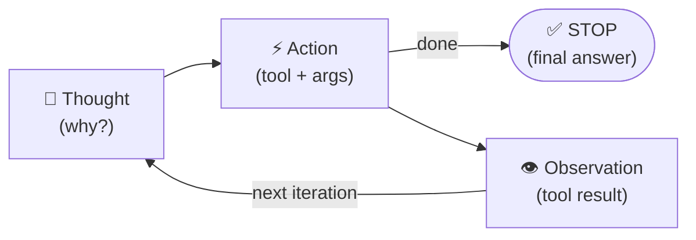

# Multi-Agent MCP System

> Designed, implemented, and benchmarked by **Konstantinos Kotsaras**  
> Bachelor thesis — Department of Informatics and Telematics, Harokopio University of Athens (HUA · DIT)

A multi-agent system built on top of the Model Context Protocol (MCP) that
answers complex user queries by coordinating a pool of specialised LLM
agents and external tool servers. The system decomposes a query into a
directed acyclic graph (DAG) of tasks, routes each task to the right MCP
server, executes it, verifies the answer, and synthesises a final
response. When a step fails it replans automatically using the
accumulated failure history so the same mistake is never repeated.

The repository also ships a full benchmark harness against MCP-Bench so
the multi-agent system can be compared head-to-head against the official
single-agent runner on identical tasks and identical judging.

---

## Architecture

The Planner sits at the centre
of a loop and chooses, on every cycle, which downstream agents (if any)
need to run before returning control to itself. Three possible paths
through one cycle:

- **Tool-using step** — Retrieval → Executor (ReAct loop) → Answer → Verifier, then back to the Planner.
- **Reasoning-only step** — the Planner handles it directly and skips the rest of the agents.
- **Final synthesis** — once all steps are done, the Planner produces the final answer.


### Planner Agent
The Planner is the only agent that decides when the loop terminates. It
plays three distinct roles, chosen on each cycle from the current state:

| Situation | What the Planner does |
|---|---|
| No plan exists | Generate the initial DAG of tasks |
| Last step passed | Advance `current_step_index` |
| Last step failed | Replan, using `failure_history` as context |
| Current step is **reasoning-only** | Reason over collected data directly — bypass Retrieval / Executor / Answer / Verifier entirely |
| All steps done | Run **final synthesis** and write `final_output` |
| Query proven unanswerable | Run **unanswerable synthesis** (faithful "we could not find X" answer) |

Plans are DAGs where tasks within a step can run in parallel and later
steps depend on the verified results of earlier ones. Reasoning steps
and final answers are produced *by the Planner itself*, not by a
downstream agent.

### Retrieval Agent
Maps each task in the current step to the most appropriate MCP server by
LLM reasoning over the live server inventory. Servers that previously
failed for a given task are excluded from selection
(`excluded_servers[task_id]`).

### Executor Agent (ReAct loop)
Runs each task with a ReAct (Reason + Act) loop. The LLM cycles through
**Thought → Action (tool call) → Observation** until it decides to stop
with a final result:



Duplicate `(tool, args)` pairs are blocked to prevent infinite tool loops.
Per-call observations are truncated to 4 000 chars (matching the official
agent) so the prompt stays inside the context window.

### Answer Agent
Receives the raw tool outputs from the Executor and structures them into
a *verification package*: one natural-language answer per task plus an
`all_parts_found` flag indicating whether the required data was actually
returned.

### Verifier Agent
Compares each task's answer against its original description and decides:

- `pass` — all tasks answered correctly; the Planner advances to the next step.
- `fail` — one or more tasks failed; the Planner is invoked for a replan.
- `impossible` — the query cannot be answered (e.g. predicting future
  stock prices or accessing data no configured MCP server holds);
  replanning stops and the Planner runs unanswerable synthesis from
  whatever was collected.

---

## Configuration

All runtime settings live in [`multi_agent_system/config.py`](multi_agent_system/config.py).
Prefer environment variables over editing the file directly.

| Env var | Default | Purpose |
|---|---|---|
| `MULTIAGENT_BASE_URL` | `https://openrouter.ai/api/v1` | OpenAI-compatible endpoint |
| `MULTIAGENT_MODEL` | placeholder (must be set) | Model id used by every agent |
| `OPENROUTER_API_KEY` | `api_key` placeholder | OpenRouter key (preferred) |
| `MULTIAGENT_API_KEY` | falls back from above | Generic key for other backends |

### Per-agent model overrides

By default all five agents share `DEFAULT_MODEL`. Override any of
`MODEL_FOR_PLANNING`, `MODEL_FOR_RETRIEVAL`, `MODEL_FOR_EXECUTOR`,
`MODEL_FOR_ANSWERING`, `MODEL_FOR_VERIFIER` in `config.py` if you want a
heterogeneous pipeline (e.g. a cheaper model for retrieval, a stronger
one for planning).

---

## Requirements & Installation

**Python 3.10+** is required.

### 1. Clone and install core dependencies

```bash
git clone <repo-url>
cd mcp-bench

pip install \
  langchain-core langchain-openai \
  openai httpx \
  mcp[cli]>=1.9.0 \
  streamlit \
  json_repair \
  python-dotenv \
  pydantic
```

### 2. Install MCP server dependencies

Each MCP server ships its own Python package. Install them all at once:

```bash
pip install -r mcp_servers/requirements.txt
```

> Some servers require npm packages (e.g. `context7`). Run
> `mcp_servers/install.sh` to handle those automatically.

---

## Setup

1. **Generate the server inventory** — run once to discover all MCP
   servers and write `multi_agent_system/inventory_summary.json`:

   ```bash
   python utils/collect_mcp_info.py
   ```

2. **Provide MCP server API keys** — some MCP servers need external
   credentials to work. They are loaded automatically from
   `./mcp_servers/api_key`. The repository ships a template; copy it
   and fill in your own values:

   ```bash
   cp mcp_servers/api_key.example mcp_servers/api_key
   # then edit mcp_servers/api_key and replace YOUR_KEY_HERE with real keys
   ```

   The real `mcp_servers/api_key` is git-ignored, so your keys never
   leave your machine. The template lives at
   [`mcp_servers/api_key.example`](mcp_servers/api_key.example) and is
   the only file tracked in git.

   All of the keys below are **free** and take ~10 minutes total to obtain:

   | Key | Server | Where to get it |
   |---|---|---|
   | `NPS_API_KEY` | `nationalparks` | <https://www.nps.gov/subjects/developer/get-started.htm> |
   | `NASA_API_KEY` | `nasa-mcp` | <https://api.nasa.gov/> |
   | `HF_TOKEN` | `huggingface-mcp-server` | <https://huggingface.co/docs/hub/security-tokens> |
   | `GOOGLE_MAPS_API_KEY` | `mcp-google-map` | <https://developers.google.com/maps> |
   | `NCI_API_KEY` | `biomcp` | <https://clinicaltrialsapi.cancer.gov/signin> — registration may require a US IP, use a VPN if needed |

   Example layout of `./mcp_servers/api_key`:

   ```
   NPS_API_KEY=...
   NASA_API_KEY=...
   HF_TOKEN=...
   GOOGLE_MAPS_API_KEY=...
   NCI_API_KEY=...
   ```

3. **Provide the LLM key** — export your OpenRouter key (or run a local
   vLLM server and point `MULTIAGENT_BASE_URL` at it):

   ```bash
   export OPENROUTER_API_KEY=sk-or-...
   export MULTIAGENT_MODEL=google/gemma-3-12b-it
   ```

---

## Quick demo

A Streamlit UI is included so anyone who clones the repo can try the
system end-to-end without writing a driver script:

```bash
pip install streamlit
streamlit run app/app.py
```

Open <http://localhost:8501> and start chatting. Features:

- **Live streaming** — every Planner cycle, tool call, and Verifier
  decision appears in the chat as it happens, with a progress bar while
  MCP servers connect.
- **Trace expanders** — after each answer, collapsible panels show the
  full DAG (tasks, dependencies, step levels), every tool call with its
  parameters and truncated result, any replans, and wall-clock stats.
- **Base / HUA scope switch** — toggle between the full pool of 29 MCP
  servers (Base) and the HUA DIT server only (HUA mode), pinned to the
  bottom chat bar.
- **Session sidebar** — live counts of connected servers and messages
  sent, current model name, agent roster, and a one-click conversation
  reset.

---

## MCP Servers

MCP-Bench ships with **28** general-purpose MCP servers spanning science,
finance, media, geo, and developer tooling. The repository also includes
one custom server for HUA benchmarking. Each task in the benchmark is
routed to one or more of these:

| Server | Domain |
|---|---|
| [BioMCP](https://github.com/genomoncology/biomcp) | Biomedical research, clinical trials, health |
| [Bibliomantic](https://github.com/d4nshields/bibliomantic-mcp-server) | I Ching divination, hexagrams, mystical guidance |
| [Call for Papers](https://github.com/iremert/call-for-papers-mcp) | Academic conference submissions and CFPs |
| [Car Price Evaluator](https://github.com/yusaaztrk/car-price-mcp-main) | Vehicle valuation and market analysis |
| [Context7](https://github.com/upstash/context7) | Project context management and docs |
| [DEX Paprika](https://github.com/coinpaprika/dexpaprika-mcp) | Crypto DeFi analytics and DEX data |
| [FruityVice](https://github.com/CelalKhalilov/fruityvice-mcp) | Fruit nutrition and dietary data |
| [Game Trends](https://github.com/halismertkir/game-trends-mcp) | Gaming industry stats and trends |
| [Google Maps](https://github.com/cablate/mcp-google-map) | Location, geocoding, and mapping |
| [HUA DIT](mcp_servers/hua-dit-mcp/) | HUA Dept. of Informatics — courses, staff, programme info *(custom, thesis-specific)* |
| [Huge Icons](https://github.com/hugeicons/mcp-server) | Icon search and design resources |
| [Hugging Face](https://github.com/shreyaskarnik/huggingface-mcp-server) | ML models, datasets, AI capabilities |
| [Math MCP](https://github.com/EthanHenrickson/math-mcp) | Mathematical calculations |
| [Medical Calculator](https://github.com/vitaldb/medcalc) | Clinical calculations and medical formulas |
| [Metropolitan Museum](https://github.com/mikechao/metmuseum-mcp) | Art collection database |
| [Movie Recommender](https://github.com/iremert/movie-recommender-mcp) | Film recommendations and movie metadata |
| [NASA Data](https://github.com/AnCode666/nasa-mcp) | Space missions and astronomical data |
| [National Parks](https://github.com/KyrieTangSheng/mcp-server-nationalparks) | US National Parks info and visitor services |
| [NixOS](https://github.com/utensils/mcp-nixos) | Package management and system configuration |
| [OKX Exchange](https://github.com/esshka/okx-mcp) | Crypto trading data and market info |
| [OpenAPI Explorer](https://github.com/janwilmake/openapi-mcp-server) | API spec exploration and testing |
| [OSINT Intelligence](https://github.com/himanshusanecha/mcp-osint-server) | Open-source intelligence gathering |
| [Paper Search](https://github.com/openags/paper-search-mcp) | Academic paper search across databases |
| [Reddit](https://github.com/dumyCq/mcp-reddit) | Social media content and discussions |
| [Scientific Computing](https://github.com/Aman-Amith-Shastry/scientific_computation_mcp) | Advanced math and data analysis |
| [Time MCP](https://github.com/dumyCq/time-mcp) | Date, time utilities, timezone conversions |
| [Unit Converter](https://github.com/zazencodes/unit-converter-mcp) | Measurement conversions |
| [Weather Data](https://github.com/HarunGuclu/weather_mcp) | Weather forecasts and meteorology |
| [Wikipedia](https://github.com/Rudra-ravi/wikipedia-mcp) | Encyclopedia content search |

---

## Running the MCP-Bench benchmark

To reproduce the numbers in the table below, run:

```bash
python mcpbench_benchmark/mcpbench_benchmark.py \
    --tasks-file mcpbench_benchmark/mcpbench_tasks_single_runner_format.json \
    --model-name $MULTIAGENT_MODEL \
    --output mcpbench_benchmark/results/mcpbench_run.json
```

The same script accepts the `multi_2server` and `multi_3server` task
files (also inside `mcpbench_benchmark/`). Per-task traces, per-server
aggregates, and a flat summary are all written next to `--output`.

To run the HUA-specific benchmark (3 tasks targeting the HUA DIT server):

```bash
python mcpbench_benchmark/mcpbench_benchmark.py \
    --tasks-file mcpbench_benchmark/mcpbench_tasks_hua_single_runner_format.json \
    --model-name $MULTIAGENT_MODEL \
    --output mcpbench_benchmark/results/hua_run.json
```

---

## Benchmark Results

### MCP-Bench (104 tasks)

Average **Overall Score** computed by the official MCP-Bench evaluator over:

- **56** single-server tasks
- **30** two-server tasks
- **18** three-server tasks
- **104** tasks total

| Model | This system | Official runner | Δ |
|---|---:|---:|---:|
| `gemma-3-12b-it` | 0.496 | **0.508** | −0.012 |
| `gemma-4-31b-it` | **0.657** | 0.647 | +0.010 |
| `llama-3.3-70b-instruct` | **0.545** | 0.538 | +0.007 |
| `qwen3.5-9b` | **0.588** | 0.586 | +0.002 |

### Per-domain breakdown (this system / official runner)

| Model | Schema Understanding | Task Completion | Tool Usage | Planning Effectiveness |
|---|---:|---:|---:|---:|
| `gemma-3-12b-it` | 0.950 / 0.838 | 0.365 / 0.374 | 0.439 / 0.544 | 0.228 / 0.273 |
| `gemma-4-31b-it` | 0.988 / 0.987 | 0.589 / 0.538 | 0.625 / 0.656 | 0.424 / 0.405 |
| `llama-3.3-70b-instruct` | 0.977 / 0.934 | 0.428 / 0.393 | 0.489 / 0.552 | 0.284 / 0.275 |
| `qwen3.5-9b` | 0.984 / 0.907 | 0.478 / 0.483 | 0.572 / 0.607 | 0.317 / 0.349 |

The multi-agent system wins on 3 of 4 models head-to-head. The largest
consistent gain is in **Schema Understanding** (clean tool-name
resolution and JSON compliance), reflecting the dedicated Executor +
Verifier loop catching malformed tool calls before they reach the judge.

### HUA DIT benchmark (3 tasks — `gemma-4-31b-it`)

Tasks targeting the custom HUA DIT server (courses, staff, programme info):

| System | Overall Score | Task Completion | Tool Usage | Planning Effectiveness | Schema Understanding |
|---|---:|---:|---:|---:|---:|
| This system | **0.735** | 0.707 | 0.798 | 0.435 | 1.000 |
| Official runner | 0.720 | 0.698 | 0.738 | 0.442 | 1.000 |

Both systems achieve perfect Schema Understanding on the HUA server
(clean local JSON schema). The multi-agent system gains on Task
Completion (+0.009) and Tool Usage (+0.060) for a net +0.015 overall.

See [`official_results/METRICS.md`](official_results/METRICS.md) for the exact aggregation
formula (mode-weighted, normalized, then averaged across the four
domains).

---

## Project Layout

```
multi_agent_system/
├── graph.py              # run_graph() — loop driver
├── state.py              # AgentState TypedDict — shared state schema
├── config.py             # LLM backend + model selection
├── utils.py              # state merge, failure handling, helpers
├── trace_recorder.py     # MCP-Bench-compatible trace capture (opt-in)
├── token_tracker.py      # per-agent token accounting
├── inventory_summary.json  # generated MCP server inventory
├── prompts/
│   └── agent_prompts.py  # Strict-JSON system prompts for every agent
└── agents/
    ├── planner.py        # coordinator + reasoning + final synthesis
    ├── retrieval.py
    ├── executor.py       # ReAct loop
    ├── answer.py
    └── verifier.py

app/                      # Streamlit demo UI
├── app.py                # orchestration (chat loop, session state)
├── backend.py            # pipeline adapter (run_graph, scope, traces)
├── ui.py                 # all Streamlit rendering (sidebar, trace, welcome)
├── log_stream.py         # live log → Streamlit status updates
└── static/
    ├── styles.css        # all custom CSS (injected once at start-up)
    ├── planner.png       # assistant chat avatar
    └── user_avatar.png   # user chat avatar

mcpbench_benchmark/
├── mcpbench_benchmark.py                        # benchmark harness: run + evaluate
├── mcpbench_tasks_single_runner_format.json     # 56 single-server tasks
├── mcpbench_tasks_multi_2server_runner_format.json
├── mcpbench_tasks_multi_3server_runner_format.json
└── mcpbench_tasks_hua_single_runner_format.json # HUA DIT tasks

benchmark/
├── evaluator.py          # MCP-Bench LLM judge + rule-based metrics
├── runner.py             # official single-agent runner
├── results_aggregator.py
└── results_formatter.py

utils/
├── collect_mcp_info.py   # generates inventory_summary.json
├── error_handler.py
└── local_server_config.py

mcp_servers/
├── commands.json         # server start commands (used by inventory script)
├── api_key.example       # template for external API keys
└── <server-name>/        # one directory per MCP server

official_results/
├── METRICS.md            # aggregation formula reference
├── multi_agent_system/<model>/   # this system's per-mode results
└── official_runner/<model>/      # official runner's per-mode results
```

---

## Acknowledgments

- Built on the [Model Context Protocol](https://modelcontextprotocol.io/)
  by Anthropic.
- Thanks to every open-source MCP server implementation listed in the
  [MCP Servers](#mcp-servers) table — this work would not exist without
  them.
- The benchmark harness, task suite, and LLM-judge rubric are derived
  from the official [**MCP-Bench**](https://github.com/Accenture/mcp-bench/) release by [Wang et al. (2025)](https://arxiv.org/pdf/2508.20453).
  The official evaluator in `benchmark/evaluator.py` is vendored unchanged so scores
  remain directly comparable to the paper.
